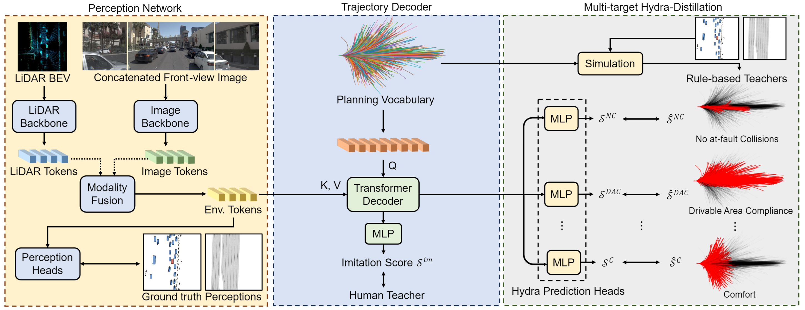

# Hydra-MDP: End-to-end Multimodal Planning with Multi-target Hydra-Distillation



### [arXiv](https://arxiv.org/abs/2406.06978) | [Talk(EN)](https://opendrivelab.com/cvpr2024/workshop/) | [Talk(CN)](https://www.bilibili.com/video/BV1Pi421i7Ch/) | [Coverage](https://youtu.be/wfpLLSz5iWY?si=rVrKsO3oITTV-i1I) | [DriveLabs](https://www.youtube.com/watch?v=06BXs-R-fQ8) | [Blog](https://blogs.nvidia.com/blog/auto-research-cvpr-2024/) | [Challenge](https://opendrivelab.com/challenge2024/#end_to_end_driving_at_scale)

This repo contains the official implementation of Hydra-MDP. Hydra-MDP is a Transformer-based E2E Planning framework that uses Hydra-distillation to enable multi-target distillation from both human and rule-based teachers. 

## News

🏆Hydra-MDP won the 1st Place and Innovation Award of the [End-to-end Driving at Scale](https://opendrivelab.com/challenge2024/#end_to_end_driving_at_scale) Track at [CVPR24 Autonomous Grand Challenge](https://opendrivelab.com/challenge2024/).

## TODO
Release code and models

## Citation

```
@article{li2024hydra,
  title={Hydra-MDP: End-to-end Multimodal Planning with Multi-target Hydra-Distillation},
  author={Li, Zhenxin and Li, Kailin and Wang, Shihao and Lan, Shiyi and Yu, Zhiding and Ji, Yishen and Li, Zhiqi and Zhu, Ziyue and Kautz, Jan and Wu, Zuxuan and others},
  journal={arXiv preprint arXiv:2406.06978},
  year={2024}
}
```
## Acknowledgements
Many thanks to the following great open-source repositories:
+ [NAVSIM](https://github.com/autonomousvision/navsim)
+ [The VAD Series](https://github.com/hustvl/VAD)
+ [Transfuser](https://github.com/autonomousvision/transfuser)
+ [tuplan_garage](https://github.com/autonomousvision/tuplan_garage)
